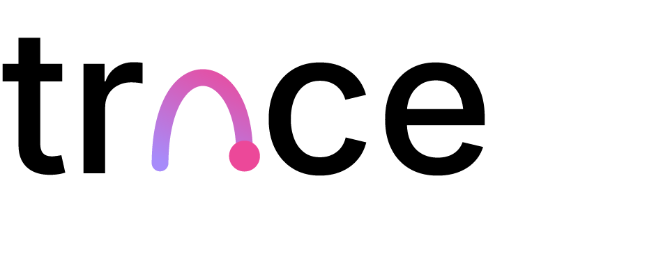

# Trace — SVG Logo Animator

A web tool that turns a static SVG logo into a stroke-by-stroke animated reveal. Drop an SVG, tweak the timing in the sidebar, export to CSS keyframes, a Python/MoviePy script, or Lottie JSON.

Live demo: **https://stephanteig.github.io/logo-animator/**



## Features

| | Feature | Status |
|---|---|---|
| **F1** | Path reorder (drag to change animation sequence) | ✓ |
| **F2** | Scrub timeline | ✓ |
| **F5** | Empty state with built-in samples | ✓ |
| **F6** | Smart defaults toggle (auto-tunes timing per file) | ✓ |
| **F8** | Per-path color picker | ✓ |
| **F9** | Loop mode: once / loop / ping-pong | ✓ |
| **F10** | Keyboard shortcuts | ✓ |
| **F11** | Split compare (animated vs original) | ✓ |
| | Export: CSS @keyframes / Python (MoviePy) / Lottie JSON | ✓ |
| | MOV / GIF render pipeline | parked |

Press `?` in the editor to see all keyboard shortcuts.

## Tech stack

- **Next.js 15** (App Router) + **TypeScript**
- **Tailwind CSS 4**
- **Geist** + **Geist Mono** + **Instrument Serif** via `next/font/google`
- Client-side SVG parsing via `DOMParser`
- RAF-driven animation engine (stroke-dash + opacity blend)
- Static export — no server required

## Run locally

```bash
npm install
npm run dev
```

Opens at http://localhost:3000.

## Build

```bash
npm run build   # produces ./out for static hosting
```

The build runs with `output: 'export'` (configured in `next.config.ts`), so the `out/` directory is a self-contained static site. In production builds the app is served from `/logo-animator/` to match the GitHub Pages path; in dev it's served from `/`.

## Deploy

GitHub Pages deployment is wired up in `.github/workflows/deploy.yml`. On every push to `main`:

1. Install deps (`npm ci`)
2. `npm run build` → `out/`
3. Copy the legacy DaisyUI app into `out/legacy/` for reference
4. Upload `out/` as a Pages artifact
5. Publish

The legacy single-file prototype stays available at `/legacy/` (for example `https://stephanteig.github.io/logo-animator/legacy/`).

## Project structure

```
app/
  layout.tsx                # Root layout, font wiring
  page.tsx                  # Main editor (state, animation loop, shortcuts)
  globals.css               # Design tokens, slider styles, syntax highlight
  components/
    HeroBand.tsx            # 56px gradient band (Spec §2)
    TraceWordmark.tsx       # Inline arc + dot wordmark
    EmptyState.tsx          # F5 — dropzone + 4 sample SVGs
    PathList.tsx            # F1 + F8 — drag reorder, color picker, eye toggle
    TraceSlider.tsx         # Custom gradient slider (white thumb + violet halo)
    AnimatedPreview.tsx     # SVG renderer — stroke-draw → fill-bloom
    KeyboardOverlay.tsx     # F10 — shortcuts modal
    ExportModal.tsx         # CSS / Python / Lottie tabs + syntax highlight
    Icons.tsx               # All inline SVG icons
  lib/
    types.ts                # PathItem, Anim, EditorState
    samples.ts              # 4 built-in sample SVGs
    svgParser.ts            # DOMParser walker + smart-defaults heuristic

public/assets/              # Brand assets — trace_logo.svg, raster fallbacks
index.html                  # Legacy DaisyUI prototype (preserved)
test.html                   # Headless-ready test suite for index.html
```

## Tests

The legacy `index.html` ships with a self-contained browser test suite (`test.html`). Open `test.html` in a browser and click **Run All Tests** — all 94 should pass before pushing changes that touch `index.html`. See `CLAUDE.md` for details.

## Design references

Source design assets live in `Trace - SVG Logo Manim.zip`:

- `README.md` — original handoff brief
- `Trace Spec.md` — full product spec, tokens, edge cases
- `Trace Demo.html` — hi-fi prototype (the ground truth for layout, type, color, interaction)
- `demo/app.jsx` — React source for the prototype
- `Trace Logo Handoff.html` — logo brand guide

The Next.js implementation matches the prototype 1:1 for layout, type, color, and interactions.

## License

MIT
